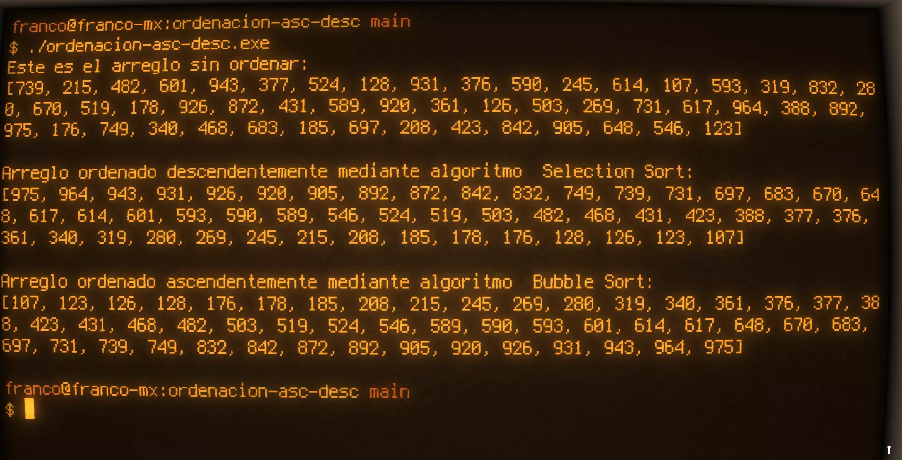

# Ordenación ascendente descendente

Implementar como procedimientos los algoritmos de ordenación por `selección` y
`burbuja`, de modo que uno de ellos trabaje en sentido ascendente y el otro en
sentido descendente. Utilizarlos en un programa que lea un vector de N
posiciones y mostrarlo ordenado en ambos sentidos.
***
## [Codificación en C](./ordenacion-asc-desc.c)

## Pseudocódigo
``` 
Programa ordenacion-asc-desc
Constantes
POS = 100

TiposEstructurados
vector = ARREGLO(POS) : Entero 4

Variables
miArreglo : vector // Supondré que está cargado en memoria

Inicio
Subprograma imprArr (arr : vector)
  i : entero 3

  Imprimir: "Arreglo ordenado: "

  RepetirPara i = 1; i = POS; i++
    Imprimir: "" + arr(i) + ", ";
  FinRepetirPara
FinSubprograma

Subprograma selSort ( REF arr : vector, N : entero 4)
  Variables
  i, j : entero 3
  aux : entero 4

  Hacer
  RepetirPara i = 1; POS - 1 ; 1
    RepetirPara j = i + 1; POS; 1
      Si(arr(i) < arr(j))Entonces
        aux := arr(i);
        arr(i) := arr(j);
        arr(j) := aux;
      FinSi
    FinRepetirPara
  FinRepetirPara
  FinHacer
FinSubprograma

Subprograma bubbSort (REF arr : vector, N : entero 4)
    Variables
    i, j, flag : entero 3
    aux : entero 4

    Hacer
    flag := 1;
    i := 1;

    RepetirMientras(flag < > 0 y i < N)
      flag := 0;

      RepetirPara j = 1; N - 1 ; 1
        Si (arr(j) > arr(j+1)) Entonces
          aux := arr(j);
          arr(j) := arr(j+1);
          arr(j+1) := aux;
          flag := 1;
        FinSi
      FinRepetirPara
    
    i := i + 1;

    FinMientras
    FinHacer
FinSubprograma

Hacer
  Imprimir: "Este es el arreglo sin ordenar";
  imprArr(miArreglo);

  Imprimir: "Arreglo ordenado ascendentemente mediante algoritmo selection sort:";
  selSort(REF miArreglo, POS);
  imprArr(miArreglo);

  Imprimir: "Arreglo ordenado descendentemente mediante algoritmo bubble sort:";
  bubbSort(REF miArreglo, POS);
  imprArr(miArreglo);

FinHacer
FinInicio
FinPrograma

```
<a href="#"
   title="Captura del output en la terminal del ejercicio">
  
</a>
